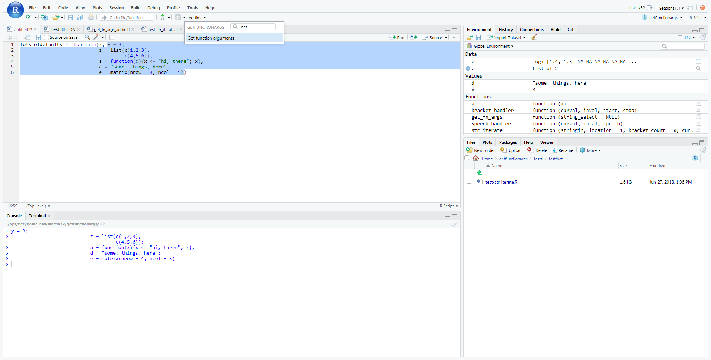
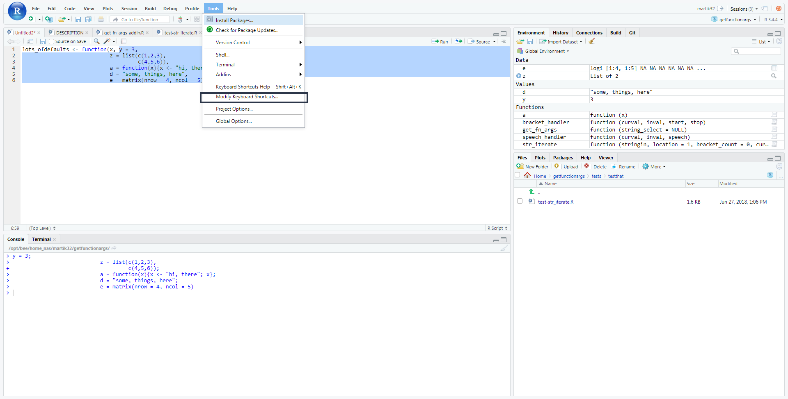
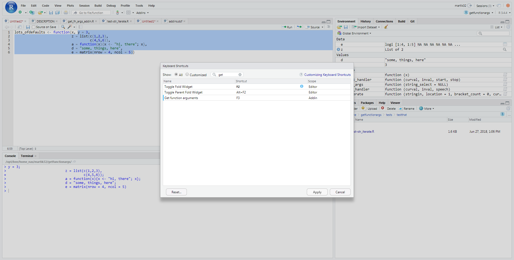

# getfunctionargs

## Introduction

This is a basic package which provides one function, and add in for R Studio called `get_fn_args`. This provides an add in option for R Studio, which, when highlighting code, will pick out individual arguments and read them to the console.

The main use case for this is when you have a function with a number of default arguments you want to read in, as in the example in the image below.

We can see that this function has read it in.

You can also call the function directly with get_fn_args("x = 4, y = 7, z = 3")

## Installation

Use 

    devtools::install_git(
      url = "https://github.roche.com/martik32/getfunctionargs.git",
    )

Then in R Studio you can load it as usual or find it on the add in menu

### Adding hot keys

It can be annoying to go to the menu, so you can assign a hot key to the command, as in these screenshots.

